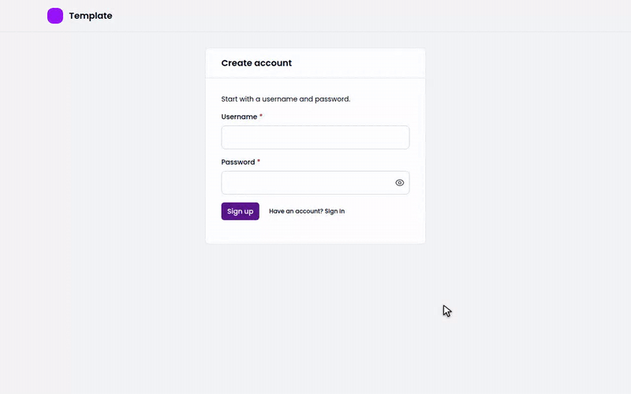
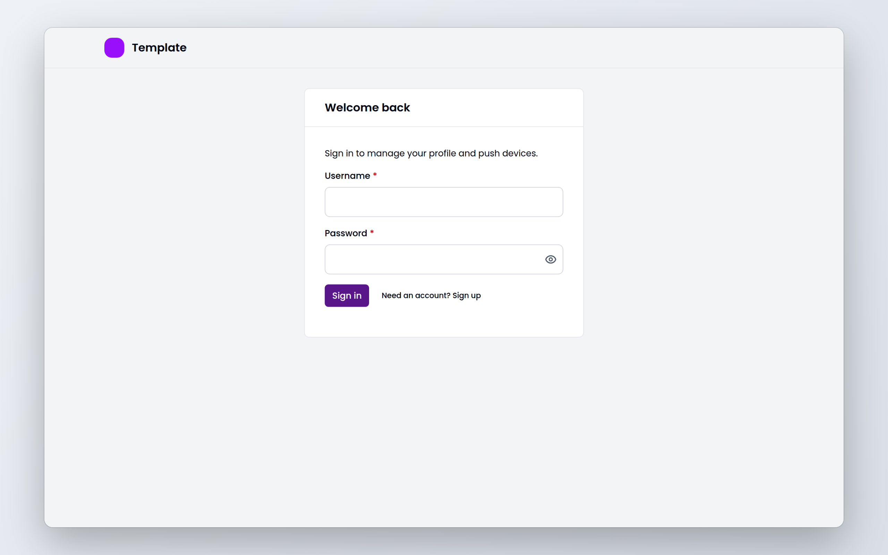
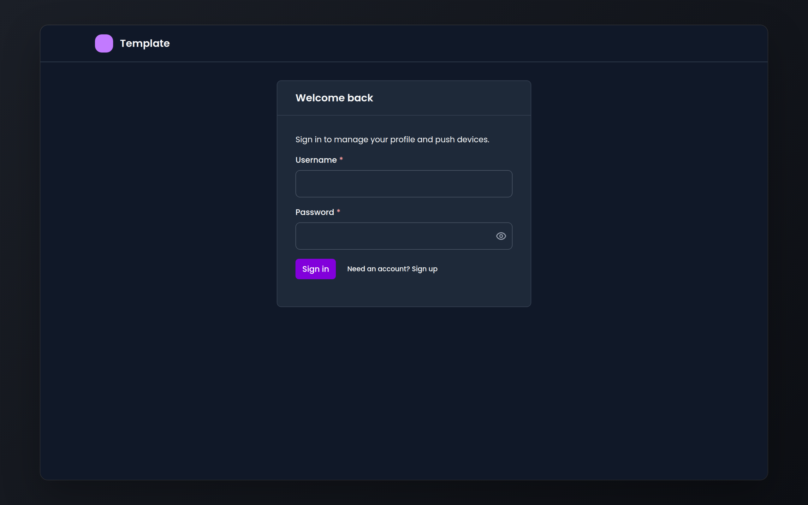
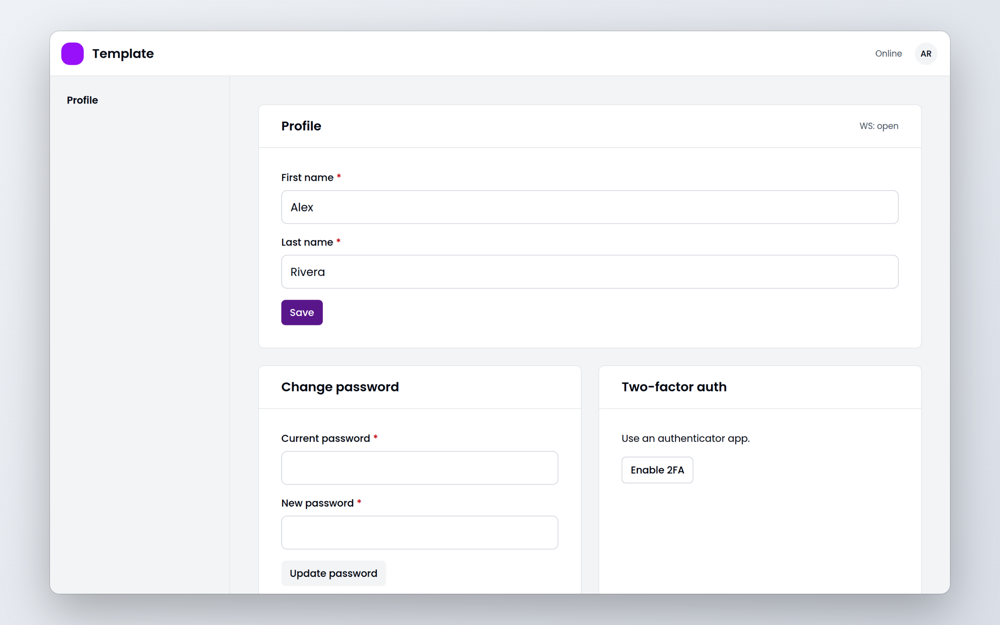
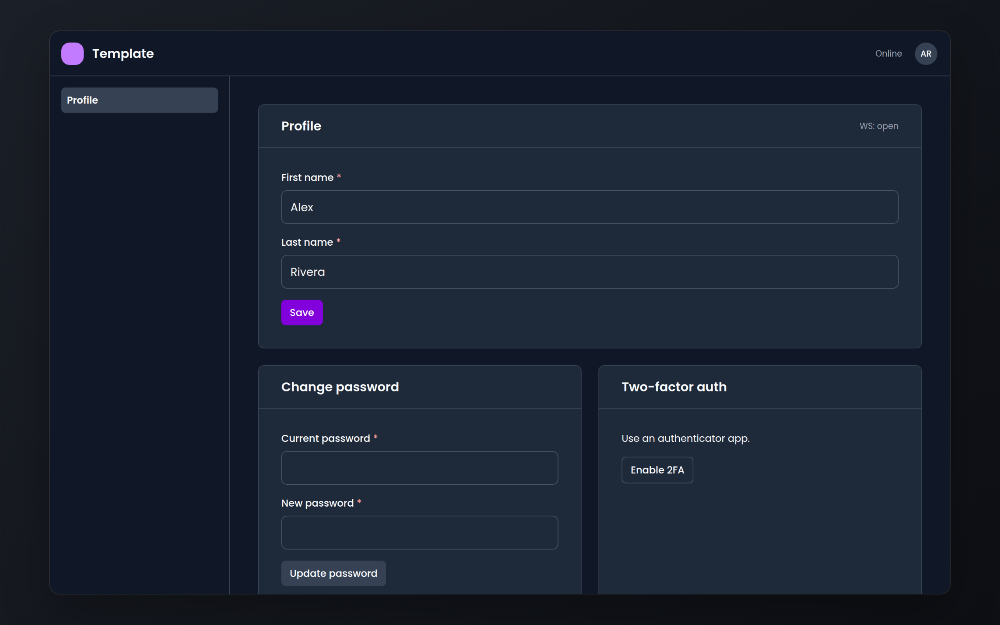

<div align="center">

# template

**A modern SaaS baseline built on web standards: auth with a second factor, groups, an API, web
clients, a worker and Postgres, already wired together.**

[](https://ci.antonshubin.com/repos/11)
[](LICENSE)

```sh
gh repo create my-product --template spy4x/template --private --clone
```



[Architecture](docs/architecture.md) · [ADR 001](docs/decisions/001-deno-platform-template.md) ·
[ADR 002](docs/decisions/002-realtime-transport-and-sync.md) · [Stack](docs/stack.md) ·
[Deno policy](docs/deno-policy.md) · [Handoff](docs/handoff.md)

</div>

Create your repository from it, fill in the env file, and you start with a product that already
has accounts, a second factor, tenancy and a place for background work. A new user signs up and
gets an account, a session and a personal group in one database transaction. Groups are the only
tenancy boundary, so the same membership checks and roles cover personal data and shared
workspaces.

It exists because every SaaS MVP needs the same groundwork before its first feature. The reusable
parts live here and in the published [`@spy4x/*`](https://jsr.io/@spy4x) packages; product rules
stay out.

**Status:** in migration. Sign-up, sign-in with TOTP, groups over REST and the outbox worker work
today; offline sync, notes, group administration and the MPA's pages do not yet. Details in
[docs/architecture.md](docs/architecture.md#migration-status) and
[ADR 001](docs/decisions/001-deno-platform-template.md).

## What a fresh project looks like

| Light                                                                                                                                                                                                 | Dark                                                                                                                                                                                                |
| ----------------------------------------------------------------------------------------------------------------------------------------------------------------------------------------------------- | --------------------------------------------------------------------------------------------------------------------------------------------------------------------------------------------------- |
|        |        |
|  |  |

The screenshots and the GIF use a throw-away database and a made-up user;
[`docs/screenshots/record.ts`](docs/screenshots/record.ts) records them again from a running app.

<details>
<summary>How the parts fit together</summary>


</details>

## Why template

- **Tenancy from day one.** Every user gets a `PERSONAL` group at sign-up; `SHARED` groups use the
  same IDs, membership checks and roles, from viewer to owner.
- **Auth that is done.** Sign-up, sign-in, sessions and an authenticator-app second factor, with
  PBKDF2-SHA-256 password hashes. Web push subscriptions are built in too.
- **CQRS with an outbox.** Commands, queries and events go through one bus. Creating a shared
  group writes its event to `outbox_events`, and the worker drains that table.
- **Safe API defaults.** Every mutation must come from the web app's own origin, and group lists
  page with HMAC-signed cursors.
- **Built on web standards.** Hono handlers take a Fetch `Request` and return a `Response`;
  password hashes and cursor signatures use Web Crypto; live updates travel over a standard
  WebSocket; everything is an ES module. The servers run on Deno 2 in Docker on any Linux host you
  control, and the clients run in any modern browser.
- **Operations included.** Docker Compose for development and single-node production: Traefik,
  Postgres, Valkey, MinIO, Loki, Prometheus and Grafana.

**Use it if** you are starting a multi-user web product and want auth, tenancy and operations
settled before the first feature. **Skip it if** you need offline sync today, or you deploy to
serverless functions rather than a server you run.

## Quick start

```sh
cp infra/envs/.env.example infra/envs/.env
```

Before going on, fill in the secrets in `infra/envs/.env`. It runs on Docker; to use Podman, set
`CONTAINER_PROVIDER=podman` (`proxy:start` and `proxy:stop` still call Docker).

```sh
deno task vapid-key:create   # web push keys → infra/configs/vapid.json
deno task proxy:start        # Traefik
deno task dev                # Postgres, Valkey, MinIO, API, SPA, logs and metrics
```

The worker and the MPA are not in Compose; run them on the host. Stop the proxy with
`deno task proxy:stop`. Apply migrations from the host with the values from your `.env`, pointing
at the port Compose publishes:

```sh
DB_HOST=127.0.0.1 DB_PORT=5432 DB_USER=<user> DB_PASS=<password> DB_NAME=<name> deno task db:migrate
```

To add a demo user `demo` who owns a shared group, run `deno task db:seed` with the same values plus
`AUTH_PEPPER` (the API's) and `SEED_PASSWORD` (the demo user's password, 8 to 50 characters).

## Production certificates

The production routers ask Traefik for certificates from the resolver named by
`TRAEFIK_CERT_RESOLVER` (default `myresolver`). `infra/compose/compose.proxy.yml` defines that
resolver: Let's Encrypt, HTTP challenge on port 80, certificates stored in
`.volumes/traefik/letsencrypt/acme.json`, expiry notices to `TRAEFIK_ACME_EMAIL`. Point `DOMAIN` at
the server and run `deno task proxy:start` there.

The template usually deploys behind a Traefik that several projects share. If that Traefik already
defines a resolver, do not start the proxy compose file: set `TRAEFIK_CERT_RESOLVER` to the name it
defines. If that Traefik defines none, copy the three `--certificatesresolvers.*` flags from
`compose.proxy.yml` into its command.

## Tasks

Current tasks come from [`deno.jsonc`](deno.jsonc).

| Task                         | What it does                                           |
| ---------------------------- | ------------------------------------------------------ |
| `deno task check`            | Lint, format check, type check and unit tests          |
| `deno task test:integration` | Integration tests against a Postgres you provide       |
| `deno task e2e`              | Playwright end-to-end tests                            |
| `deno task db:migrate`       | Apply the SQL migrations in `libs/server/db`           |
| `deno task spa:build`        | Build the SPA                                          |
| `deno task deploy`           | Copy the production files to the server and start them |

Run individual app tasks with `api:*`, `spa:*`, or `mpa:*`. Deno workspace members inherit shared
imports and tooling settings from root `deno.jsonc`.

## Development

```sh
deno task check
deno task hooks:install   # runs the checks before every commit
```

See [CONTRIBUTING.md](CONTRIBUTING.md) for the rules, and [docs/handoff.md](docs/handoff.md) for
the state of the migration and the traps in this codebase.

## Built by

I'm [Anton Shubin](https://antonshubin.com), a senior full-stack engineer and tech lead. This
template is the foundation I build client SaaS MVPs on. Need an MVP built for your product?
[That's my day job →](https://antonshubin.com/catalog/zero-to-production-saas-mvp)

Licensed under [MIT](LICENSE). Copyright (c) 2026 Anton Shubin.

---

Made by Anton Shubin · [antonshubin.com/tools](https://antonshubin.com/tools)
